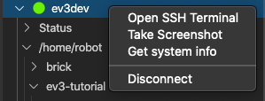
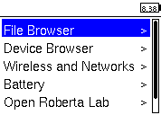

Introduction to the EV3
=======================

Installation
------------

Flollow the instructions on the 
`LEGO Education site
<https://education.lego.com/en-us/support/mindstorms-ev3/python-for-ev3>`_
to use Python on your EV3

- download the microSD image to your computer
- flash the image to the microSD card using a tool such as
  `Etcher <https://www.balena.io/etcher/>`_
- insert the microSD card into EV3 brick
- download the **VS Code** editor to your compouter
- install the EV3 extensions

Get system information
----------------------

In the **EV3DEV device browser** you have access to a context menu.

It allows you to : 

- open the SSH Terminal (entering automatically the password)
- take a (color) screenshop of the EV3 display

This is the system info you get::

  ========== ev3dev-sysinfo ==========
  Image file:         ev3-micropython-v1.0.0-sd-card-image
  Kernel version:     4.14.96-ev3dev-2.3.2-ev3
  Brickman:           0.10.0
  BogoMIPS:           148.88
  Bluetooth:          
  Board:              board0
  BOARD_INFO_HW_REV=8
  BOARD_INFO_MODEL=LEGO MINDSTORMS EV3
  BOARD_INFO_ROM_REV=6
  BOARD_INFO_SERIAL_NUM=001653601922
  BOARD_INFO_TYPE=main

Connect to the EV3 using ssh
----------------------------

You can connect to EV3 brick remoteyl via a SSH terminal.
Click in the **EV3DEV device browser** to connect to the EV3.
Open a terminal and connect via SSH to ``robot@ev3dev.local``

The password is **maker**::

    user@MacBook-Air brick % ssh robot@ev3dev.local
    Warning: Permanently added the ECDSA host key for IP address 'fe80::16:53ff:fe60:1922%en4' to the list of known hosts.
    Password: 
    Linux ev3dev 4.14.96-ev3dev-2.3.2-ev3 #1 PREEMPT Sun Jan 27 21:27:35 CST 2019 armv5tejl
                _____     _
    _____   _|___ /  __| | _____   __
    / _ \ \ / / |_ \ / _` |/ _ \ \ / /
    |  __/\ V / ___) | (_| |  __/\ V /
    \___| \_/ |____/ \__,_|\___| \_/

    Debian stretch on LEGO MINDSTORMS EV3!
    robot@ev3dev:~$ 

Execute Linux commands
----------------------

You can print the working directory::

    pwd
    /home/robot

Display the list of current folders::

    ls
    brick  getting_started  sensors

Change directory to **brick** and display its content::

    cd brick/
    ls
    battery.py  brick.rst  button.py  display2.py  display.py  main.py  sound2.py  sound.py

Run a Python session
--------------------

Run a Python session::

    python3
    Python 3.5.3 (default, Sep 27 2018, 17:25:39) 
    [GCC 6.3.0 20170516] on linux
    Type "help", "copyright", "credits" or "license" for more information.
    >>> 

Execute some Python commands::

    >>> print('hello world')
    hello world
    >>> 99**12
    886384871716129280658801

Text to speech
--------------

From the command line you can start text-to-speech::

  espeak "hello, I am an EV3.
  > I like to talk because I am a robot.
  > Did you know that robots like to make sounds?
  > Beep. Boop. Dit. Dit. Meep.
  > I am just such a chatterbox." --stdout | aplay

Update the system
-----------------

You can update the Debian operating system::

  sudo apt-get update

  We trust you have received the usual lecture from the local System
  Administrator. It usually boils down to these three things:

      #1) Respect the privacy of others.
      #2) Think before you type.
      #3) With great power comes great responsibility.

  [sudo] password for robot: 

Demo example
------------

This is a demo example for a simple Python program.

.. literalinclude:: intro1.py

Import classes and methods
--------------------------

These are all the useful classes and methods.

.. literalinclude:: intro2.py

Micro-python vs real Python
---------------------------

The first line of the program, the so-called **shebang**, 
indicates to the EV3 which Python it is going to use.
LEGO proposes the use of Micropython, which is starting up slightly faster::

  #!/usr/bin/env pybricks-micropython

To use real Python put this on your first line::

  #!/usr/bin/env python3

You get bigger fonts and get text-to-speech.

.. literalinclude:: intro3.py

Sources

- https://sites.google.com/site/ev3devpython/ 
- https://www.udemy.com/course/ev3-python/ 